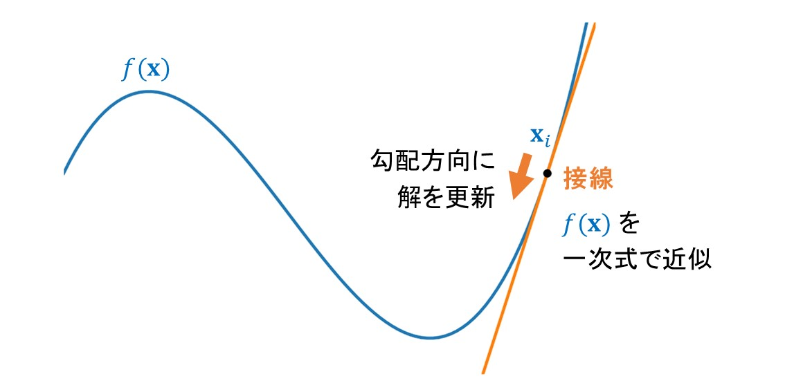
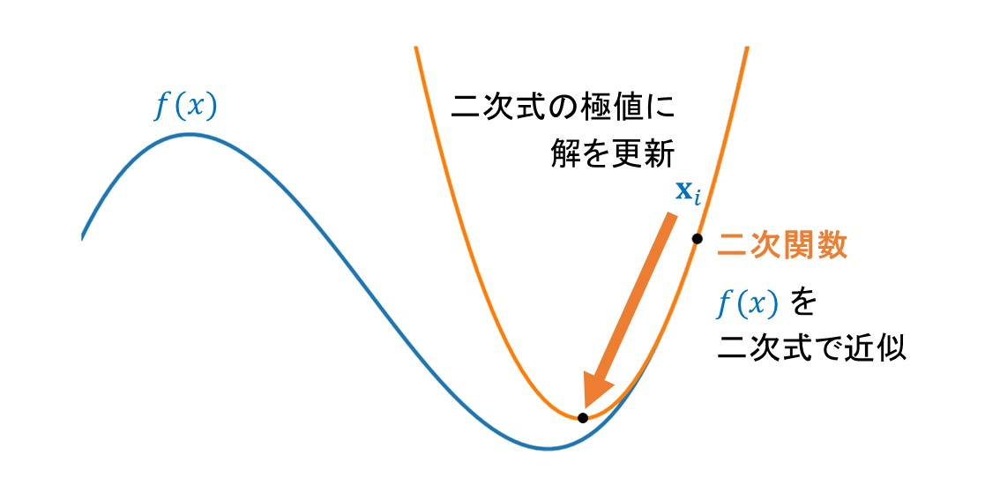

# Overview
Python code that validates the performance of various continuous optimization algorithms using various benchmark functions.


# Environment setup
Requires Numpy.


# Usage
(0) Open `main.py` and set the arguments of the main function and optimizer.
```
def main(optimizer_type=newton_method, second_optimizer_type=adam, function=MullerBrownPotential):
    optimizer = Optimizer(optimizer_type, second_optimizer_type, learning_rate=0.01)
```
`optimizer_type`: Specify either candidate **gradiend_descent**, **momentum**, **adagrad**, **rmsprop**, **adam**, **adabelief** and **conjugate_gradient**.  
`function`: Specify either candidate **Sphere**, **Rosenbrock**, **Beale**, **ThreeHumpCamel**, **Himmelblau** or **MullerBrownPotential**.

(1) Run `main.py`.  
```
python main.py
```
Then, optimization results will be visualized.


# Behavior
`optimizer_type` で指定した最適化アルゴリズム（オプティマイザー）を用いて、 `function` で指定されたベンチマーク関数の極値を探索する。  

基本的には local minimum を探索するが、オプティマイザーにニュートン法を用いた場合、初期値に依存して saddle point に到達することがある。この場合、`second_optimizer_type` で指定されたオプティマイザーを用いて、 saddle point から虚振動方向への最小エネルギー経路（MEP）を自動で探索する。  

極値に到達 or 最大イタレーション回数を超えた段階で最適化を打ち切り、その点におけるヘッセ行列の固有値と固有ベクトルをヤコビ法を用いて求めて収束判定を行う。最後に、最適化における座標の変遷を 2 次元・ 3 次元プロット上に示し、勾配の変遷も可視化する。

オプティマイザーの `eigen_check` オプションが `False` の場合、固有値・固有ベクトルの解析はスキップされ、 MEP 探索も行われない。また、`find_mep` オプションが `False` であれば、`eigen_check` が `True` でも MEP 探索は行われない。


# Module
各モジュールの詳細は以下の通り。
## **main.py**
プログラム実行用のモジュール。  
main 関数の引数の `optimizer_type` と `function` をそれぞれ指定し `python run.py` で本プログラムを実行する。　　

## **vibration.py**
最適化で得られた点におけるヘッセ行列の固有値と固有ベクトルを、や媚法を用いて求めるためのモジュール。  


## **visualization.py**
最適化の結果を可視化するためのモジュール。  
各ベンチマーク関数を可視化する関数も用意した。


## **gradient.py**
勾配ベクトルおよびヘッセ行列を求めるためのモジュール。  

後述の通り、今回の目的は 2 変数関数の local minimum を求めることである。このとき、勾配ベクトル $\nabla f(x)$ およびヘッセ行列 $H(x) = \nabla^2f(x)$ は以下のように表せる。

$$\large\begin{align}
\nabla f(x) &= 
\begin{bmatrix}
\frac{\partial f}{\partial x}\\
\frac{\partial f}{\partial y}
\end{bmatrix}\\
H(x) &= 
\large\begin{bmatrix}
\frac{\partial^2 f}{\partial x^2} & \frac{\partial^2 f}{\partial x \partial y}\\
\frac{\partial^2 f}{\partial y \partial x} & \frac{\partial^2 f}{\partial y^2}
\end{bmatrix}
\end{align}$$

なお、全ての微分は中心差分法を用いて計算される。

$$\large\begin{align}
f'(x) &\approx \frac{f(x+h)-f(x-h)}{2h}
\end{align}$$

## **benchmark.py**
最適化アルゴリズムの性能をベンチマークするための関数を定義したモジュール。  
以下の関数が実装されており、再現性を取るため初期値を乱数シードで固定している。

### **Sphere function**
$$\large\begin{align}
f(x,y) = x^2 + y^2
\end{align}$$

$$\large\begin{align*}
-50 \leq x \leq 50\\
-50 \leq y \leq 50
\end{align*}$$


### **Rosenbrock function**
$$\large\begin{align}
f(x,y) = (a-x)^2 + b(y-x^2)^2
\end{align}$$

$$\large\begin{align*}
a=1, b=100
\end{align*}$$

$$\large\begin{align*}
-2 \leq x \leq 2\\
1 \leq y \leq 3
\end{align*}$$


### **Beale function**
$$\large\begin{align}
f(x,y) = (1.5 - x + xy)^2 + (2.25 - x + xy^2)^2 + (2.625 - x + xy^3)^2
\end{align}$$

$$\large\begin{align*}
-4 \leq x \leq 4\\
-4 \leq y \leq 4
\end{align*}$$


### **Three-Hump Camel function**
$$\large\begin{align}
f(x,y) = 2x^2 - 1.05x^4 + \frac{x^6}{6} + xy + y^2
\end{align}$$

$$\large\begin{align*}
-2 \leq x \leq 2\\
-2 \leq y \leq 2
\end{align*}$$


### **Himmelblau function**
$$\large\begin{align}
f(x,y) = (x^2 + y - 11)^2 + (x + y^2 - 7)^2
\end{align}$$

$$\large\begin{align*}
-6 \leq x \leq 6\\
-6 \leq y \leq 6
\end{align*}$$


### **Muller-Brown Potential**
$$\large\begin{align}
E(x,y)=\sum_{i=1}^4A_iexp[a_i(x-X_i)^2+b_i(x-X_i)(y-Y_i)+c_i(y-Y_i)^2]
\end{align}$$

$$\large\begin{align*}
A_i &= [-200, -100, -170, 15]\\
a_i &= [-1, -1, -6.5, 0.7]\\
b_i &= [0, 0, 11, 0.6]\\
c_i &= [-10, -10, -6.5, 0.7]\\
X_i &= [1, 0, -0.5, -1]\\
Y_i &= [0, 0.5, 1.5, 1]\\
\end{align*}$$

$$\large\begin{align*}
-2.5 \leq x \leq 1.5\\
-1.0 \leq y \leq 3.0
\end{align*}$$


## **optimizer.py**
オプティマイザークラスと最適化アルゴリズムを実装したモジュール。学習率や収束判定、最大イタレーション数を引数で調整できる。以下の最適化アルゴリズムが実装されている。

$\alpha$ は学習率、 $\beta、 \beta_1、 \beta_2$ は減衰率などを表すハイパーパラメータであり、 $\epsilon$ はゼロ除算を避けるための微小な値である。また、 $\nabla f(x)$ と $H(x)$ は、それぞれベンチマーク関数の勾配ベクトルとヘッセ行列である。以下の説明では $\nabla f$ および $H$ と簡略化した記法を適宜用いる。

### **Gradient descent**

$$\large\begin{align}
x_t = x_{t-1} - \alpha\nabla f_{t-1}
\end{align}$$

Gradient descent (最急降下法) は、現在の解 $(x,y)$ における関数 $f$ の勾配ベクトル $\nabla f$ の方向 (=関数 $f$ の変化率が最も大きい方向) に解を更新する操作を繰り返し、関数の local minimum を探索するアルゴリズムである。「最も急な方向に降下する」ことが最急降下法という名前の由来であり、勾配法としては最も単純なアルゴリズムである。  

最急降下法の更新式について、テイラー展開の観点から考えてみる。ベンチマーク関数を $f(x)$ としたとき、現在の点 $x=a$ における $f(x)$ の一次のテイラー展開は以下の式で表させる。

$$\large\begin{align}
f(x) \approx f(a)+\nabla f(x-a)
\end{align}$$

これは点 $(a, f(a))$ で $f(x)$ に接する接線の一次式である。従って、この一次式の傾き $\nabla f$ と逆の方向に進めば $f(x)$ の値を小さくできる。以上より、最急降下法の更新式は、注目している関数を現在の点周りで一次のテイラー展開により近似し、得られた一次式の傾きの情報を元に解を更新していることがわかる。最急降下法の更新式の概念図を以下に示した。  



最急降下法は一次収束することが知られており、ニュートン法のように二回微分を求めずに済む代わりに、最適化に要するステップ数が増える。

### **Momentum**

$$\large\begin{align}
v_t &= \beta v_{t-1} + (1-\beta)\nabla f_{t-1}\\
x_t &= x_{t-1} - \alpha v_t
\end{align}$$

Momenutum (モーメンタム) は、過去の勾配の情報を慣性として利用し、最急降下法における最適化速度と安定性を向上させたアルゴリズムである。最急降下法における勾配 $\nabla f$ 部分を補正した手法であると解釈できる。  

最急降下法の問題点として、local minimum 付近で最適化の効率が低下する点が挙げられる。これは、local minimum 付近で解の更新幅が大きくなりすぎて解が振動してしまい、収束に時間がかかるためである。そこで Momentum では、現在の勾配 $\nabla f$ だけでなく、過去の勾配の情報を速度ベクトル $v$ として加味することで解の振動を抑制する。  

Momentum の更新式では、過去の速度ベクトル $v_{t-1}$ を $\beta$ の重み、現在の勾配 $\nabla f$ を $(1-\beta)$ の重みで考慮した加重平均を計算して現在の速度ベクトル $v$ としている。この更新式は指数移動平均の更新式と同じ形であり、古い勾配の情報ほど指数関数的に重みを減少させた平滑化を行っている。この $v$ のような勾配の指数移動平均は、最適化アルゴリズムの文脈において一次モーメント呼ばれる。即ち、Momentum は勾配の一次モーメントを用いて解の更新量を調整した手法であるとも言える。  

さて、 $v$ の具体的な中身について確認してみよう。 $v$ の初期ベクトル $v_0$ をゼロベクトルとすると、 $v$ は以下のように変化していく。

$$\large\begin{align}
v_1 &= (1-\beta)\nabla f_0\\
v_2 &= \beta(1-\beta)\nabla f_0 + (1-\beta)\nabla f_1\\
    &= (1-\beta)(\beta\nabla f_0 + \nabla f_1)\\
v_3 &= \beta\{(1-\beta)(\beta\nabla f_0 + \nabla f_1)\} + (1-\beta)\nabla f_2\\
    &= (1-\beta)(\beta^2\nabla f_0 + \beta\nabla f_1 + \nabla f_2)
\end{align}$$

従って、T 回目の更新における $v_T$ は以下の式で表せる。

$$\large\begin{align}
v_T &= (1-\beta)(\beta^{T-1}\nabla f_0 + \beta^{T-2}\nabla f_1 + ... + \beta\nabla f_{T-2} + \nabla f_{T-1}\\
    &= (1-\beta)\sum_{t=1}^T \beta^{T-t}\nabla f_{t-1}
\end{align}$$

以上より、速度ベクトル $v$ は過去の全ての勾配の情報を含むと共に、古い勾配ほど減衰率 $0\leq\beta\leq1$ で影響力を小さくしている。この $v$ を利用することで、解の更新方向が現在の勾配だけでなく過去の勾配 (=今まで動いてきた方向、即ち慣性) も足し合わせて決定されるため、解の振動が抑制されて最適化の安定性が向上すると期待される。

### **AdaGrad**

$$\large\begin{align}
v_t &= v_{t-1} + \nabla f_{t-1}^2 \\
x_t &= x_{t-1} - \alpha\frac{1}{\sqrt{v_t}+\epsilon}\nabla f_{t-1}
\end{align}$$

AdaGrad は、過去の勾配の情報を元に学習率を自動的に調整し、最急降下法における最適化速度と安定性を向上させたアルゴリズムである。Momentum が最急降下法における勾配 $\nabla f$ 部分を補正した手法であるのに対し、AdaGrad は学習率 $\alpha$ 部分を補正した手法である。  

AdaGrad の更新式を見ると、学習率 $\alpha$ がベクトル $v$ によって割られている。この $v$ の具体的な中身について確認してみよう。Momentum と同様に $v_0$ をゼロベクトルとすると、 $v$ は以下のように変化していく。

$$\large\begin{align}
v_1 &= \nabla f_0^2\\
v_2 &= \nabla f_0^2 + \nabla f_1^2\\
v_3 &= \nabla f_0^2 + \nabla f_1^2 + \nabla f_2^2
\end{align}$$

従って、T 回目の更新における $v_T$ は以下の式で表せる。

$$\large\begin{align}
v_T &= \nabla f_0^2 + \nabla f_1^2 + ... + \nabla f_{T-2}^2 + \nabla f_{T-1}^2\\
    &= \sum_{t=1}^T \nabla f_{t-1}^2
\end{align}$$

以上より、 $v$ は過去の全ての勾配の二乗和を加算したベクトルであり、学習率 $\alpha$ は $v$ に比例して減衰する。 $v$ のいずれの要素もイタレーション毎に勾配の二乗和が加算されていくので、各要素は基本的に単調増加である。従って、最適化のイタレーションが進むにつれて $v$ の各要素はより大きな値を持つようになる。それに伴い、 $\alpha$ の減衰具合も大きくなって解の更新量が小さくなる。即ち、よく更新される (=勾配が大きい) パラメータの $\alpha$ は大幅に減衰して小さな値となり、更新が少ないパラメータは比較的大きな $\alpha$ を持つことになる。  

この更新方法には 2 つの働きがある。1 つ目は、元々の目的である最適化の速度と安定性の向上である。即ち、解が local minimum から離れていると考えられる最適化初期には、解の各パラメータを大幅に更新して大胆に local minimum を探索し、最適化が進んだ終盤には解が振動しないようにパラメータを少しずつ更新するという働きである。  

2 つ目は、パラメータごとに異なる学習率を割り当てることで、パラメータの特性に寄り添うことである。即ち、大きな勾配が観測されるパラメータは local minimum に到達するまでに何度も更新が必要であると予想されるため、迅速に学習率を減衰させて丁寧に更新する。一方、観測される勾配が小さいまたは 0 であることが多いパラメータは、勾配が観測される僅かな機会を生かすべく、学習率をあまり減衰させずに比較的大きな更新幅を維持するという働きである。

### **RMSProp**

$$\large\begin{align}
v_t &= \beta v_{t-1} + (1-\beta)\nabla f_{t-1}^2\\
x_t &= x_{t-1} - \alpha\frac{1}{\sqrt{v_t}+\epsilon}\nabla f_{t-1}
\end{align}$$

RMSProp は、AdaGrad を改良したアルゴリズムである。AdaGrad の問題点として、最適化のイタレーションが進むにつれて学習率が 0 に近づき、解の更新が行われなくなってしまう点が挙げられる。そこで RMSProp では、AdaGrad で考慮していた勾配の二乗和に対し、Momentum と同様に移動平均を考慮する。  

RMSProp の更新式では、過去のベクトル $v_{t-1}$ を $\beta$ の重み、現在の勾配の二乗和 $\nabla f^2$ を $(1-\beta)$ の重みで考慮した加重平均を計算して現在のベクトル $v$ としている。この更新式は Momentum と同様に指数移動平均の更新式と同じである。また $v$ のような勾配の二乗の指数移動平均は、最適化アルゴリズムの文脈において二次モーメント（中心化されていない分散）と呼ばれる。即ち、RMSProp は勾配の二次モーメントを用いて学習率を調整した手法であるとも言える。

さて、 $v$ の具体的な中身について確認してみよう。これまでと同様に $v$ の初期ベクトル $v_0$ をゼロベクトルとすると、 $v$ は以下のように変化していく。

$$\large\begin{align}
v_1 &= (1-\beta)\nabla f_0^2\\
v_2 &= \beta(1-\beta)\nabla f_0^2 + (1-\beta)\nabla f_1^2\\
    &= (1-\beta)(\beta\nabla f_0^2 + \nabla f_1^2)\\
v_3 &= \beta\{(1-\beta)(\beta\nabla f_0^2 + \nabla f_1^2)\} + (1-\beta)\nabla f_2^2\\
    &= (1-\beta)(\beta^2\nabla f_0^2 + \beta\nabla f_1^2 + \nabla f_2^2)
\end{align}$$

従って、T 回目の更新における $v_T$ は以下の式で表せる。

$$\large\begin{align}
v_T &= (1-\beta)(\beta^{T-1}\nabla f_0^2 + \beta^{T-2}\nabla f_1^2 + ... + \beta\nabla f_{T-2}^2 + \nabla f_{T-1}^2\\
    &= (1-\beta)\sum_{t=1}^T \beta^{T-t}\nabla f_{t-1}^2
\end{align}$$

Momentum の更新式における $v$ の一般項との違いは、勾配 $\nabla f$ 部分が勾配の二乗和 $\nabla f^2$ になった点だけである。しかし、Momentum と違い、 $v$ は勾配ではなく学習率を調整するために利用される。

### **Adam**

$$\large\begin{align}
m_t &= \beta_1 m_{t-1} + (1-\beta_1)\nabla f_{t-1}\\
v_t &= \beta_2 v_{t-1} + (1-\beta_2)\nabla f_{t-1}^2
\end{align}$$

バイアス補正を行い

$$\large\begin{align}
\hat{m_t} &= \frac{m_t}{1-\beta_1^t}\\
\hat{v_t} &= \frac{v_t}{1-\beta_2^t}\\
x_t       &= x_{t-1} - \alpha\frac{\hat{m_t}}{\sqrt{\hat{v_t}}+\epsilon}\\
\end{align}$$

上 3 つの式をまとめて以下の更新式を得る。

$$\large\begin{align}
x_t = x_{t-1} - \alpha\frac{\sqrt{1-\beta_2^t}}{1-\beta_1^t}\frac{m_t}{\sqrt{v_t}+\epsilon}
\end{align}$$

Adam (Adaptive Moment Estimation) は Momentum と RMSProp を組み合わせたアルゴリズムである。 勾配の一次モーメント $m$ の更新式は Momentum、勾配の二次モーメント $v$ の更新式は RMSProp と同じであり、過去の勾配の指数移動平均を考慮して解の更新方向を調整し、過去の勾配の二乗和の指数移動平均を考慮して学習率を調整していることがわかる。  

また、バイアス補正は最適化初期の探索効率を向上する目的で行われる。Adam の更新式における $m$ と $v$ は 0 ベクトルで初期化されているので、 $\beta_1$ と $\beta_2$ が大きい最適化の初期段階では各モーメントの推定値が 0 ベクトルの方向に向かいやすいというバイアスが働く。そこで、最適化初期のモーメントの推定値を拡大する補正を行う。即ち、バイアス補正の式の分母の $1-\beta_1^t$ と $1-\beta_2^t$ は、最適化初期には 1 に近い値をとるが、イタレーションが進むにつれて指数的に 0 に漸近する（ $0 \leq\beta_1, \beta_2\leq$ のため）。これにより、徐々にバイアス補正を緩和した最適化が可能となる。

### **AdaBelief**

$$\large\begin{align}
m_t &= \beta_1 m_{t-1} + (1-\beta_1)\nabla f_{t-1}\\
s_t &= \beta_2 s_{t-1} + (1-\beta_2)(\nabla f_{t-1} - m_t)^2 + \epsilon
\end{align}$$

バイアス補正を行い

$$\large\begin{align}
\hat{m_t} &= \frac{m_t}{1-\beta_1^t}\\
\hat{s_t} &= \frac{s_t}{1-\beta_2^t}\\
x_t       &= x_{t-1} - \alpha\frac{\hat{m_t}}{\sqrt{\hat{s_t}}+\epsilon}\\
\end{align}$$

上 3 つの式をまとめて以下の更新式を得る。

$$\large\begin{align}
x_t = x_{t-1} - \alpha\frac{\sqrt{1-\beta_2^t}}{1-\beta_1^t}\frac{m_t}{\sqrt{s_t}+\epsilon}
\end{align}$$

AdaBelief (Adapting Stepsizes by the Belief in Observed Gradients) は Adam を改良したアルゴリズムである。AdaBelief の更新式は Adam と似ているが、 $s_t$ (Adam における $v_t$ )の更新方法に違いがある。即ち、Adam において $v_t$ は勾配の二乗和のみを用いて更新されていたが、AdaBelief では勾配の一次モーメントも加味して更新されている。この差異について簡単に述べる。  

まず、勾配の一次モーメントは勾配の指数移動平均のことを指している。指数移動平均とは古いデータほど指数関数的に重みを減少させて平滑化を行う手法である。よって、勾配の一次モーメントは現在の勾配と過去の勾配の情報を利用して計算された勾配の期待値であると言える。ここで $s_t$ の更新式に注目すると、 $(\nabla f_{t-1} - m_t)^2$ の部分は、現在の勾配および勾配の期待値の差分をとった二乗和を計算していることになる。従って、現在の勾配と勾配の期待値の値が近ければ $(\nabla f_{t-1} - m_t)^2$ は小さくなり、結果的に $s_t$ も小さくなる。このとき、 $s_t$ は学習率 $\alpha$ に対して分母に作用するので、 $\alpha$ が大きくなる。これは、現在の勾配が勾配の期待値と近ければ、学習率を大きくとって大幅に解を更新することを意味する。逆に現在の勾配が勾配の期待値とかけ離れていれば、学習率を小さくとって丁寧に解を更新していく。  

以上より、AdaBelief は現在の勾配の信用度合 (belief) を元に適用的 (adaptive) に解を更新する手法であると解釈できる。

### **共役勾配法**
実装済み。随時加筆予定。

### **Newton's method**

$$\large\begin{align}
x_t = x_{t-1} - H^{-1}\nabla f_{t-1}
\end{align}$$

Newton's method （ニュートン法）または Newton-Rapfson method（ニュートン・ラプソン法）は、現在の解 $(x,y)$ における関数 $f$ の勾配ベクトル $\nabla f$ およびヘッセ行列 $H$ の逆行列の情報を用いて解を更新する操作を繰り返し、関数の local minimum を探索するアルゴリズムである。 

ニュートン法の更新式について、最急降下法と同様にテイラー展開の観点から考えてみる。ベンチマーク関数を $f(x)$ とし、 $f(x)$ の二次のテイラー展開で得られた二次式（後述）が最小値を取る $x$ を $x_0$ とし、 $x_0$ と現在の位置の差分を $\Delta x$ とする。 $x = x_0 + \Delta x$ とすると、 $x$ における $f(x)$ の二次のテイラー展開は以下の式で表させる。

$$\large\begin{align}
f(x)=f(x_0+\Delta x) \approx f(\Delta x)+\nabla f(\Delta x)+\frac{1}{2}\Delta x^TH(\Delta x)\Delta x\\
\end{align}$$

これは点 $(a, f(a))$ で $f(x)$ に接する曲線の二次式である。この二次式が最小値をとるときの $\Delta x$ を求めれば、 $\Delta x$ だけ現在の解 $x$ を更新することで $f(x)$ の値も小さくできることが期待される。具体的には、二次式の微分が 0 となる点を求めれば良い。  

まず

$$\large\begin{align}
\frac{df}{dx} = \frac{df}{d\Delta x}\frac{d \Delta x}{dx} = \frac{df}{d\Delta x}
\end{align}$$

なので

$$\large\begin{align}
\frac{df}{dx} = \frac{df}{d\Delta x} \approx 0 + \nabla f(\Delta x) + H(\Delta x)\Delta x
\end{align}$$

である。従って、二次式が最小値をとるときの $\Delta x$ は

$$\large\begin{align}
\Delta x = -H(\Delta x)^{-1}\nabla f(\Delta x)
\end{align}$$

である。これはニュートン法の更新式における解の更新量と同じである。

以上より、ニュートン法の更新式は、注目している関数を現在の点周りで二次のテイラー展開により近似し、得られた二次式が最小値を取る場所に解を更新していることがわかる。ニュートン法の更新式の概念図を以下に示した。  



ニュートン法は二次収束することが知られており、一次収束する最急降下法よりも高速に最適化を発見できる。一方で、初期推定値によっては解が発散する可能性や、ヘッセ行列の計算には多くのコストを要するという問題点もある。特にヘッセ行列の計算コストの観点で、現実の最適化問題に対しては適用が困難な場合が多い。

### **BFGS method**
未実装。随時加筆予定。


# Tips
## **移動平均**
移動平均は、時系列データを平滑化する手法であり、主に**単純移動平均**と**加重移動平均**、**指数移動平均**の 3 種が用いられる。  
・単純移動平均: ある範囲のデータの平均をとって平滑化する。単純移動平均の一般式は以下のように表せる。

$$\large\begin{align}
y_t = \frac{x_t+x_{t-1}+x_{t-2}+...+x_{t-n+2}+x_{t-n+1}}{n}
\end{align}$$

・加重移動平均: 古いデータほど線形に重みを減少させ、平滑化を行う。この方法では、ある程度古いデータの重みは全て 0 になる。加重移動平均の一般式は以下のように表せる。

$$\large\begin{align}
y_t = \frac{nx_t+(n-1)x_{t-1}+(n-2)x_{t-2}...+2x_{t-n+2}+x_{t-n+1}}{n+(n-1)+(n-2)+...+2+1}
\end{align}$$

・指数移動平均: 古いデータほど指数関数的に重みを減少させ、平滑化を行う。この方法では、古いデータの重みが完全に 0 になることはない。また、単純移動平均や加重移動平均では過去のデータを記憶しておかなければならないのに対し、指数移動平均は直前の移動平均だけを記憶しておけば良いというメリットもある。指数移動平均の一般式は以下のように表せる。

$$\large\begin{align}
y_t = (1-\alpha)x_{t-1} + \alpha x_t
\end{align}$$

指数移動平均は、過去の情報に基づいて現在の値を計算し、滑らかな移動や更新を実現するという点で慣性 (モーメント) と共通している。Momentum・RMSProp・Adam の更新式は、勾配および勾配の二乗の指数移動平均を求めて解を更新する。


## **モーメント**
最適化の文脈におけるモーメントは、Momentum や RMSProp の更新式で見たように勾配の指数移動平均（一次モーメント）や勾配の二乗の指数移動平均（二次モーメント）を指す。  

一方、確率論におけるモーメントは確率変数 $X$ のべき乗の期待値である。 $X$ を確率変数、 $α$ を定数と、 $\mathbb{E}$ が期待値を表すとすると、 $α$ に関する $n$ 次モーメントの一般式は以下のように表せる。

$$\large\begin{align}
\mathbb{E}[(X-\alpha)^r]
\end{align}$$

特に $α$ が 0 のときは原点周りのモーメント、 $α$ が $X$ の期待値 $μ$ のときは期待値周りのモーメントと呼ばれることが多い。ここで、いくつかの統計量がモーメントで表せることを示す。

$$\large\begin{align}
\mu &= \mathbb{E}[X] = \frac{1}{n}\sum X\\
\sigma^2 &= \mathbb{E}[(X-\mu)^2] = \frac{1}{n}\sum (X-\mu)^2\\
\gamma &= \frac{\mathbb{E}[(X-\mu)^3]}{\sigma^3} = \frac{1}{n}\sum\frac{(X-\mu)^3}{\sigma^3}\\
\kappa &= \frac{\mathbb{E}[(X-\mu)^4]}{\sigma^4} = \frac{1}{n}\sum\frac{(X-\mu)^4}{\sigma^4}\\
\end{align}$$

$\mu$ は $X$ の期待値であり、原点周りの 1 次モーメントである。一方、 $\sigma^2$ は $X$ の分散であり、期待値周りの 2 次モーメントである。 $\gamma$ は $X$ の歪度、 $\kappa$ は $X$ の尖度であり、それぞれ期待値周りの 3 次、4 次モーメントを $\sigma$ で正規化した指標である。  

歪度は分布の歪みの度合いを定量化する指標であり、確率分布が左右対称か調べるのに利用できる。歪度が正のとき、確率分布は左に偏っており、右に裾広がりなことを意味する。これは、右側の外れ値の寄与によってモーメントが正の値の 3 乗になりやすいためである。逆に、歪度が負の場合は分布が右に偏っており、分布の左側に裾広がりである。理由も同様で、左側の外れ値の寄与によってモーメントが負の値の 3 乗になりやすいためである。歪度が 0 に近い場合は、分布が比較的左右対称なことを意味する。  

尖度は分布の期待値近傍領域への集中具合および裾の重さの度合いを定量化する指標である。  

このように、最適化と確率論の文脈においてモーメントは異なる意味を持つことに注意する（間違っていたら教えて下さい）。


## **ヤコビ法**
随時加筆予定。


# 参考文献
[最適化アルゴリズムを評価するベンチマーク関数まとめ](https://qiita.com/tomitomi3/items/d4318bf7afbc1c835dda)  
[【決定版】スーパーわかりやすい最適化アルゴリズム -損失関数からAdamとニュートン法-](https://qiita.com/omiita/items/1735c1d048fe5f611f80#7-adam)  
[「テイラー展開」の分かりやすい解説](https://science-log.com/%e6%95%b0%e5%ad%a6/%e3%80%8c%e3%83%86%e3%82%a4%e3%83%a9%e3%83%bc%e5%b1%95%e9%96%8b%e3%80%8d%e3%81%ae%e5%88%86%e3%81%8b%e3%82%8a%e3%82%84%e3%81%99%e3%81%84%e8%a7%a3%e8%aa%ac/)  
[接線の方程式の求め方【微分】法線の方程式も解説！](https://rikeilabo.com/tangent-and-normal)  
[最急降下法とニュートン法の比較](http://techtipshoge.blogspot.com/2016/07/blog-post.html)  
[6.1.4：Momentum【ゼロつく1のノート(実装)】](https://www.anarchive-beta.com/entry/2020/08/10/180000)  
[6.1.5：AdaGrad【ゼロつく1のノート(実装)】](https://www.anarchive-beta.com/entry/2020/08/11/180000)  
[6.1.x：RMSProp【ゼロつく1のノート(実装)】](https://www.anarchive-beta.com/entry/2020/08/12/180000)  
[6.1.6：Adam【ゼロつく1のノート(実装)】](https://www.anarchive-beta.com/entry/2020/08/13/180000)  
[俺はまだ本当のAdamを理解していない](https://qiita.com/exp/items/99145796a87cc6cd47e1)  
[Adam: A Method for Stochastic Optimization](https://arxiv.org/abs/1412.6980)  
[出きたてホヤホヤ！最新オプティマイザー「AdaBelief」を解説！](https://arxiv.org/abs/2010.07468)  
[AdaBelief Optimizer: Adapting Stepsizes by the Belief in Observed Gradients](https://arxiv.org/abs/2010.07468)  
[共役勾配法](https://qiita.com/Dason08/items/27559e192a6a977dd5e5)  
[非線形共役勾配法](https://ja.wikipedia.org/wiki/%E9%9D%9E%E7%B7%9A%E5%BD%A2%E5%85%B1%E5%BD%B9%E5%8B%BE%E9%85%8D%E6%B3%95)  
[移動平均](https://ja.wikipedia.org/wiki/%E7%A7%BB%E5%8B%95%E5%B9%B3%E5%9D%87)  
[モーメント(moment)を直感的・具体的に理解する　〜平均、分散、歪度、尖度 etc〜](https://www.hello-statisticians.com/explain-terms-cat/moment1.html)  


# ToDo 
・BFGS法を実装する

<!--
## **gradient.py**
勾配を求めるためのモジュール。  
中心差分法を用いて一階微分を求める。

$$\begin{align}
f'(x) &\approx \frac{f(x+h)-f(x-h)}{2h}\\
f''(x) &\approx \frac{f'(x+h)-f'(x-h)}{2h}
\end{align}$$

連続最適化とは関係ないが、機械学習に用いる特徴量を相関係数や分散だけでなく、歪度や尖度の情報も元に前処理している研究があり、面白いと思った。
-->